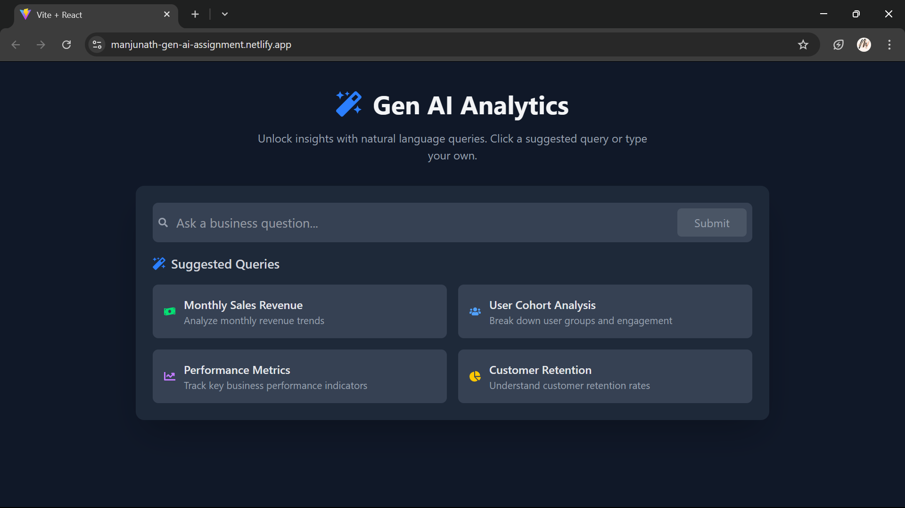

# Gen AI Dashboard

## 🚀 Project Overview

This project is a **React-based Data Query Dashboard** that demonstrates AI-powered natural language query interaction and result visualization. It simulates a Gen AI Analytics tool that enables users to ask complex business questions and receive instant insights, eliminating dependency on data teams.

## ✨ Features

- **Natural Language Query Input**: Users can input business-related queries.
- **AI-Powered Suggestions**: Suggests relevant queries as the user types.
- **Query History Section**: Keeps track of previously asked queries.
- **Results Display with Charts**: Uses Recharts to visualize results dynamically.
- **State Management with Redux**: Efficiently manages query submission and result states.
- **Loading & Error Handling**: Displays appropriate states while processing queries.
- **Responsive Design**: Works seamlessly across devices.

## 🛠️ Tech Stack

- **Frontend**: React.js
- **State Management**: Redux Toolkit
- **Styling**: Tailwind CSS
- **Data Visualization**: Recharts

## 📸 Screenshots



## 🏗️ Installation & Setup

To run this project locally, follow these steps:

1. **Clone the repository**

   ```sh
   git clone https://github.com/Banda-Manjunatha/Growth-Gear-Assignment.git
   cd gen-ai-dashboard
   ```

2. **Install dependencies**

   ```sh
   npm install
   ```

3. **Start the development server**

   ```sh
   npm run dev
   ```

4. **Open in browser**
   Navigate to `http://localhost:your_port`.

## 🚀 Deployment

This project is deployed on **[Netlify](https://manjunath-gen-ai-assignment.netlify.app/)**.

## 📝 Usage Guide

1. Type a business-related query in the input field.
2. Select a suggested query or enter your own.
3. Click the submit button to process the query.
4. View the results in the form of dynamic charts.
5. Access past queries from the history section.

## 📌 Folder Structure

```
📦 src
 ┣ 📂 components    # UI Components (QueryInput, ChartDisplay, etc.)
 ┣ 📂 utils         # Mock Data Processing & Helpers
 ┣ 📂 styles        # Tailwind CSS Styles
 ┣ 📜 App.js        # Main Application File
 ┣ 📜 index.js      # Entry Point
```

## 🔥 Challenges & Learnings

- Implementing **Redux for global state management**.
- Creating **dynamic chart visualizations** with mock data.
- Managing **query history efficiently**.
- Simulating **AI-powered suggestions** for better UX.

## 👤 Author

- **Manjunatha Banda**
- [GitHub](https://github.com/Banda-Manjunatha)
- [LinkedIn](https://www.linkedin.com/in/manjunatha-banda)

## 🎯 Future Enhancements

- Integrate **real AI-powered query processing**.
- Add **authentication and user profiles**.
- Implement **export options for reports**.

## 🏆 Acknowledgments

- Thanks to **Recharts**, **Redux Toolkit**, and **Tailwind CSS** for making this possible!
